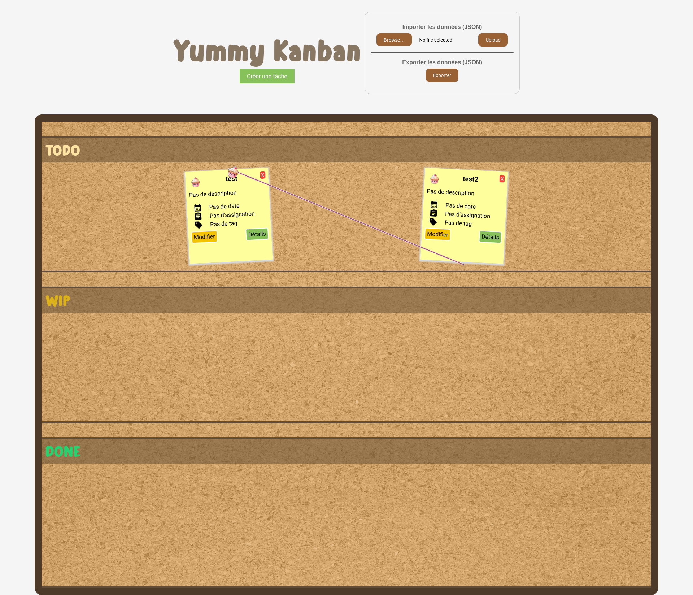
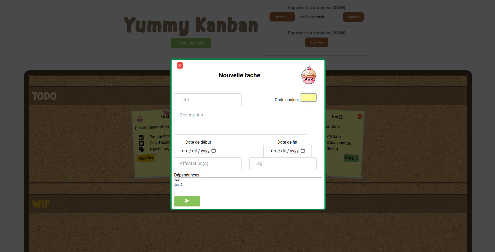

# A52 Projet - Kanban Oueb

## À propos




Projet réalisé dans le cadre du module A52 Qualité de développement, consistant à réaliser une application web de gestion de projet Kanban en HTML/CSS/JS (Vanilla).

## Documents
- [Rapport](Rapport_-_Projet_A52.pdf)
- [Cahier des charges](specifications.md)
- [Démonstration du site](https://kanban-oueb-walter-abid-wawrzyniak-c06b00b84973f1902195f1978292.pages.unistra.fr/)


## Membres du groupe
- ABID Julien
- WALTER Damien
- WAWRZYNIAK Maxime


## Prérequis
- Node.js >= 20.0.0
- npm >= 10.0.0
- vite.js >= 5.0.8

```md
## Installation
# Cloner le projet
git clone git@git.unistra.fr:walter-abid-wawrzyniak/kanban-oueb.git

# Se déplacer dans le dossier du projet
cd kanban-oueb

# Installer les dépendances
npm install

# Lancer le serveur de développement
npm run dev

# Build
npm run build

# Tests
npm test

# Vérifier la mise en forme des fichiers javascript
npm run lint .
# ou
npm run lint <fichier>
```
## License

Distribué sous licence MIT. Voir [License](./LICENSE) pour plus d'informations.